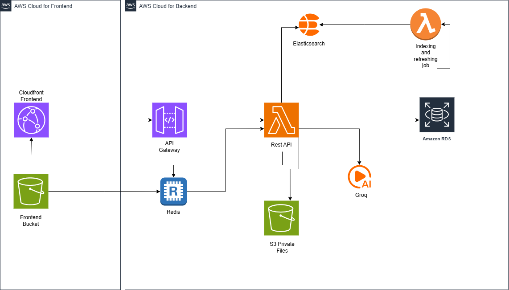
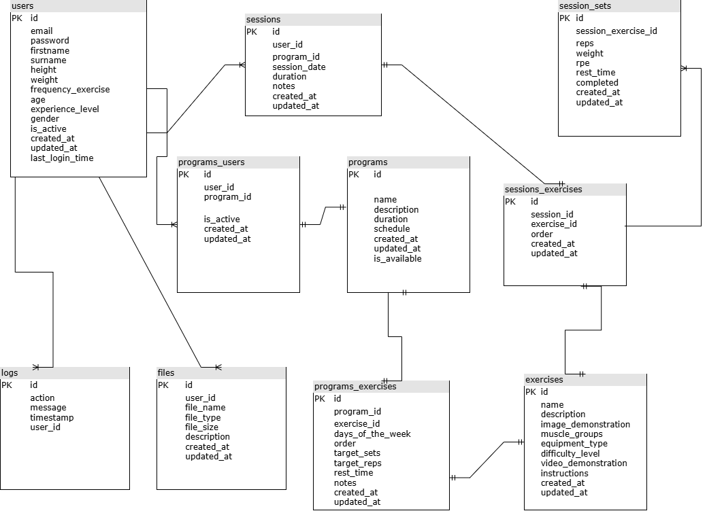

# Workout Tracker API

A serverless-ready workout tracking API built with NestJS and TypeORM.

## Features & Tech Stack

- **Framework**: NestJS (Serverless Framework for AWS Lambda)
- **Database**: PostgreSQL (TypeORM)
- **Search**: Elasticsearch
- **Caching**: Redis
- **Storage**: AWS S3
- **AI**: Groq API for workout recommendations

## Quick Start

### Prerequisites
- Node.js 20+
- PostgreSQL, Redis, Elasticsearch
- AWS S3 Bucket & Groq API Key

### Installation

1. Copy env file: `cp .env.example .env`
2. Configure `.env` with your credentials.
3. Install dependencies: `npm install`

### Running Locally

```bash
# Development
npm run start:dev

# Production Build
npm run build && npm run start:prod

# Serverless Offline
npm run serverless:offline
```

### Migrations

```bash
# Generate
npm run migration:generate -- src/migrations/Name

# Run
npm run migration:run
```

## Architecture





## Project Structure

```
src/
├── modules/          # Feature modules (User, Exercise, Program, Session, etc.)
├── services/         # Shared services (Redis, S3, Groq, Elasticsearch)
├── middlewares/      # Global middlewares
├── config/           # Configuration files
├── utils/            # Utility functions
└── app.module.ts     # Root module
```

## API Endpoints

### Authentication
- `POST /api/v1/auth/signup` - Register
- `POST /api/v1/auth/login` - Login
- `GET /api/v1/auth/me` - Get profile
- `PUT /api/v1/auth/profile` - Update profile

### Exercises
- `GET /api/v1/exercises` - List exercises
- `POST /api/v1/exercises` - Create exercise
- `GET /api/v1/exercises/:id` - Get details
- `PUT /api/v1/exercises/:id` - Update
- `DELETE /api/v1/exercises/:id` - Delete

### Programs
- `GET /api/v1/programs` - List programs
- `POST /api/v1/programs` - Create program
- `GET /api/v1/programs/:id` - Get details
- `PUT /api/v1/programs/:id` - Update
- `DELETE /api/v1/programs/:id` - Delete
- `POST /api/v1/programs/:id/exercises` - Add exercise
- `PUT /api/v1/programs/:id/exercises/:exerciseId` - Update exercise details
- `DELETE /api/v1/programs/:id/exercises/:exerciseId` - Remove exercise

### Sessions
- `GET /api/v1/sessions` - History
- `POST /api/v1/sessions` - Start session
- `GET /api/v1/sessions/latest` - Latest session
- `GET /api/v1/sessions/:id` - Details
- `DELETE /api/v1/sessions/:id` - Delete
- `POST /api/v1/sessions/:id/complete` - Finish session
- `POST /api/v1/sessions/:id/exercises` - Add exercise
- `POST /api/v1/sessions/:id/sets` - Add set
- `PUT /api/v1/sessions/sets/:setId` - Update set
- `DELETE /api/v1/sessions/sets/:setId` - Delete set

### Analytics
- `GET /api/v1/analytics/progress`
- `GET /api/v1/analytics/muscle-distribution`
- `GET /api/v1/analytics/stats`

### AI Coach
- `POST /api/v1/ai-coach/generate-workout`
- `POST /api/v1/ai-coach/analyze`

### Dashboard
- `GET /api/v1/dashboard`

### Search & Tutorials
- `GET /api/v1/search`
- `GET /api/v1/search/suggestions`
- `GET /api/v1/tutorials/search`
- `GET /api/v1/tutorials/recommended`

### Files
- `POST /api/v1/files/upload`
- `GET /api/v1/files/signed-url`
